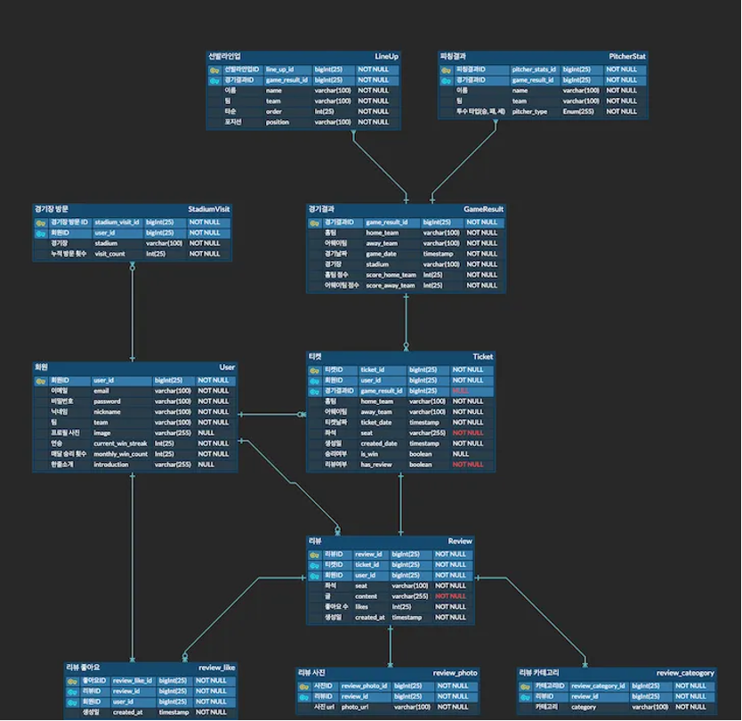

# ⚾️ 야구 직관 기록 앱 BallFan  ⚾️

## 프로젝트 소개

🏷 **프로젝트 명 : BallFan**

🗓️ **프로젝트 기간 : 2025.02.01 ~ 2025.06.23**

👥 **구성원 : 김효민(PM, Design, FE), 김수환(FE), 김동현(FE), 임진영(BE, Infra, AI), 심용석(AI)**

🏆 **수상 : 아주대학교 SOFTCON 개발 부문 우수상**

---

### 😎 서비스 구경 바로가기

**🎥 서비스 소개 영상 : https://softcon.ajou.ac.kr/works/works.asp?uid=2085**

---

### ✅ 기획 배경 및 서비스 소개


---


## 💌 서비스 화면 및 기능 소개

### ✅ 서비스 흐름도

- **회원가입 및 마이팀 설정**
> 이메일, 비밀번호, 닉네임, 마이팀을 입력 받아 회원가입을 진행한다.

<p align="center">
  
</p>

---

- **로그인 및 홈 화면(티켓 저장소)**
> 회원가입 시, 가입했던 정보를 바탕으로 로그인을 진행한다.

<p align="center">
  
</p>

---

- **OCR 기반 티켓 등록 및 확인**
> PaddleOCR(GPU 기반)을 활용해 티켓 사진에서 경기 날짜와 원정팀 정보를 추출한다.  
> 추출한 정보를 기반으로, 스탯티즈 야구 기록 사이트에서 자동 크롤링한 경기 데이터와 매핑하여 티켓을 저장한다.  
> 사용자는 홈 화면에서 등록된 티켓을 통해 다양한 경기 정보를 확인할 수 있다.

<p align="center">
  
</p>

---

- **티켓 리뷰 등록 및 확인**
> 1. 사용자가 입력한 티켓 리뷰 텍스트를 OpenAI 임베딩 모델로 벡터화하여 Chroma DB에 저장한다.
> 2. 리뷰와 함께 입력된 좌석 정보도 함께 저장되어 이후 추천 기준으로 활용한다.
> 3. 리뷰 텍스트를 LangChain을 통해 분석하고, OpenAI와 Naver Search API를 이용해 리뷰에서 장소 관련 키워드를 추출한다.
> 4. 추출된 장소 키워드를 기반으로 Naver Search API에서 해당 장소의 위경도 정보를 받아온다.
> 5. 위경도 정보를 프론트로 전달하여 Naver Map API를 통해 지도에 해당 장소를 시각화한다.
> 6. 저장된 리뷰 벡터와 좌석 정보를 기반으로, 유사한 좌석 리뷰나 내용이 비슷한 리뷰를 사용자에게 추천한다.
> 7. 리뷰 텍스트를 기반으로 LLM이 분석하여 리뷰에 어울리는 키워드 역시 추천한다.
> 8. 이를 통해 사용자들은 유사 좌석에 대한 시야나 분위기 등의 정보를 간접적으로 파악할 수 있다.

<p align="center">
  
  
</p>
<p align="center">
  
</p>

---

- **명예의 전당(승률 및 방문 경기장)**
> 사용자가 설정한 응원 팀 기준으로, 팀 내 유저들의 직관 승률을 비교하여 최고 승요를 확인할 수 있다.  
> 월간 기준으로 가장 높은 승률을 기록한 유저를 ‘이달의 승요’로 표시한다.  
> 전체 사용자 중 승률이 가장 높은 유저를 조회할 수 있는 기능을 제공한다.  
> 사용자가 방문한 모든 경기장 목록과 각 경기장별 방문 횟수를 확인할 수 있다.  
> 경기장을 방문할 때마다 스탬프가 지급되어 사용자에게 기록과 수집의 재미를 제공한다.

<p align="center">
  
  
</p>

---

- **마이 홈(내 리뷰 확인 및 프로필 수정)**
> 마이홈에서 자신이 작성한 리뷰를 모아서 확인할 수 있다.  
> 자신의 닉네임 및 프로필 사진을 변경할 수 있다.

<p align="center">
  
  
</p>

> 마이홈에서 자신이 좋아요를 누른 리뷰를 확인할 수 있다.  
> 앱을 종료하고 싶다면 로그아웃을 진행한다.

<p align="center">
  
  
</p>


## 🛠 기술 스택

### FE
<p>
  
  
  
  
  
</p>


### BE
<p>
	
	
	
</p> 

### AI
<p>
	
	
	
    
    
    
    
</p> 

### DB
<p>
  
  
</p>


### Dev-Ops
<p>
    
	
	
	
    
</p>


### Communication
<p>
	
	
	
    
</p>


## 🗂 프로젝트 구조

### FE
#### https://github.com/hwansoo17/ballfan

```markdown
└─📦 src
  ├─📂 api
  ├─📂 assets
  │  ├─📂 fields
  │  ├─📂 fonts
  │  ├─📂 svgs
  ├─📂 bottomTabs
  ├─📂 components
  ├─📂 bottomTabs
  ├─📂 hooks
  │  ├─📂 mutation
  ├─📂 nav
  ├─📂 screens
  │  ├─📂 auth
  │  ├─📂 home
  │  ├─📂 mypage
  │  ├─📂 ranking
  │  ├─📂 record
  ├─📂 store
  ├─📂 styles 
  └─📜 App.tsx
```

---

### BE
#### https://github.com/jinyoung1226/BallFan

```markdown
├─📂 java
    📦 BallFan
    ├─📂 authentication
    │  ├─📂 filter
    ├─📂 controller
    ├─📂 dto
    │  ├─📂 auth
    │  ├─📂 line_up
    │  ├─📂 pitcher
    │  ├─📂 record
    │  ├─📂 response
    │  ├─📂 review
    │  ├─📂 stadium
    │  ├─📂 ticket
    │  └─📂 user
    ├─📂 entity
    │  ├─📂 pitcher
    │  ├─📂 review
    │  ├─📂 token
    │  └─📂 user
    ├─📂 exception
    │  ├─📂 auth
    │  ├─📂 review
    │  ├─📂 stadium
    │  ├─📂 ticket
    │  ├─📂 user
    ├─📂 jackson
    ├─📂 repository
    ├─📂 s3
    ├─📂 service
    ├─🧩 BallFanApplication
```

## 📜 프로젝트 산출물

### 시스템 아키텍쳐

---

### ERD


---

### API 명세서


---

### 메뉴 트리


---

### 정보구조도


## 💙 팀원 소개
| 김효민 (PM, FE, Design)                                                                                              | 임진영 (BE, Infra, AI)                                                                                                                                     | 김수환 (FE)                                                    |
|------------------------------------------------------------------------------------------------------------------|----------------------------------------------------------------------------------------------------------------------------------------------------------|-------------------------------------------------------------|
| 기획 및 디자인 총괄 <br> Figma 기반 UI/UX 설계 <br> 기능 요구사항 정의 및 흐름도 작성 <br> 전당 페이지 구현 <br> 마이홈 페이지 구현 | 백엔드 및 인프라 총괄 <br> DB 모델링 및 API 개발 <br> CI/CD 파이프라인 구축 <br> Nginx 및 SSL 인증서 설정 <br> LangChain 기반 리뷰 분석 시스템 및 벡터 DB 연동 <br> 유사 리뷰 추천 기능 및 장소 키워드 추출 API 개발 | 회원가입 및 로그인 로직 구현 <br> JWT 토큰 인증 방식 구현 <br> 프론트엔드 디렉토리 구조 설계 |
| https://github.com/rlagyals                                                                                        | https://github.com/jinyoung1226                                                                                                                          | https://github.com/hwansoo17                                |

| 김동현(FE)                                                                                       | 심용석(AI)                                                                                                                        |
|-----------------------------------------------------------------------------------------------|--------------------------------------------------------------------------------------------------------------------------------|
| Front-End 총괄 <br> 회원가입 및 로그인 페이지 구현 <br> 홈, 티켓 등록 페이지 구현 <br> 기록 페이지 구현 <br> Naver Map API 연동 | AI 총괄 <br> PaddleOCR 기반 야구 지류 티켓 인식 모델 개발 <br> 경기 결과 자동 수집을 위한 크롤링 시스템 구축 <br> FastAPI 기반 크롤링 API 개발 및 DB 연동                   |
| https://github.com/DongDongsqq                                                                 | https://github.com/yongseokSim                                                                                   |